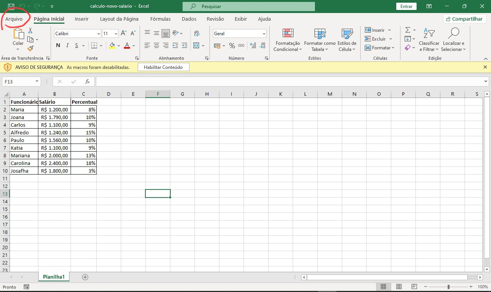
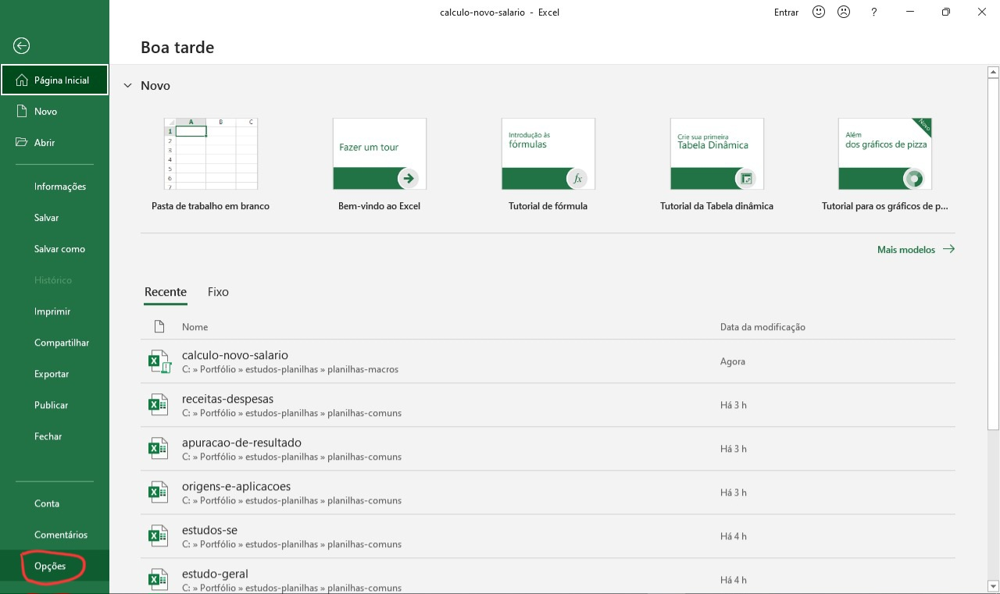
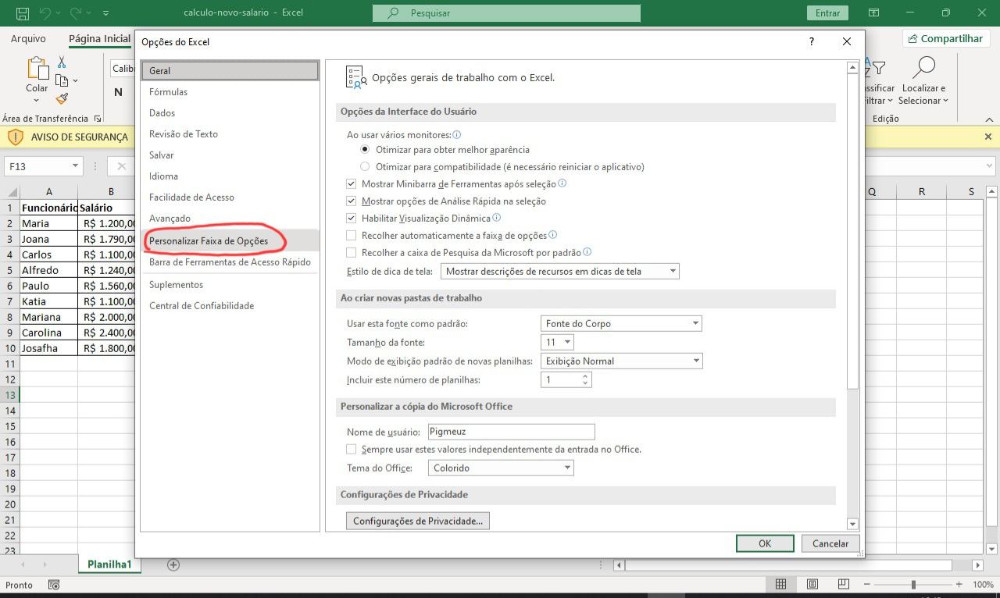
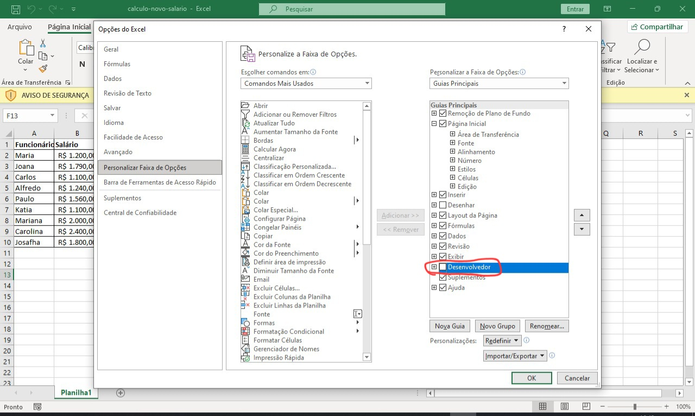
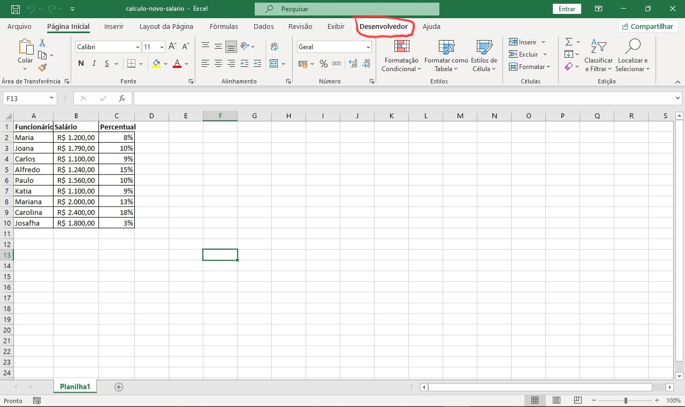
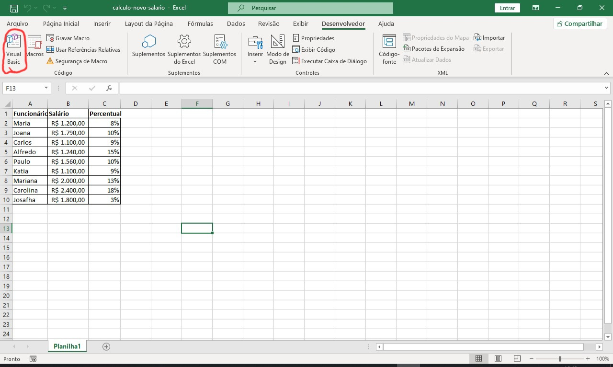
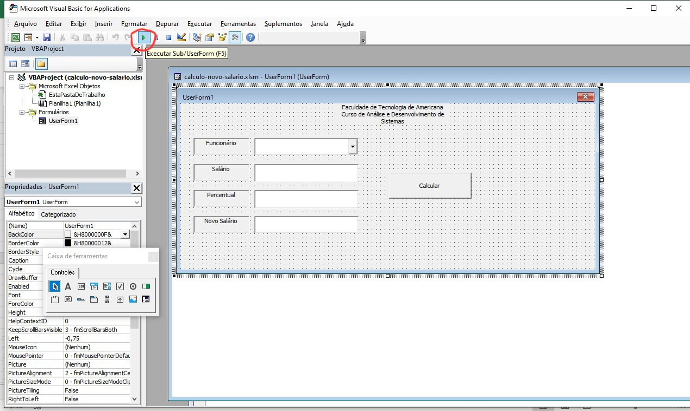
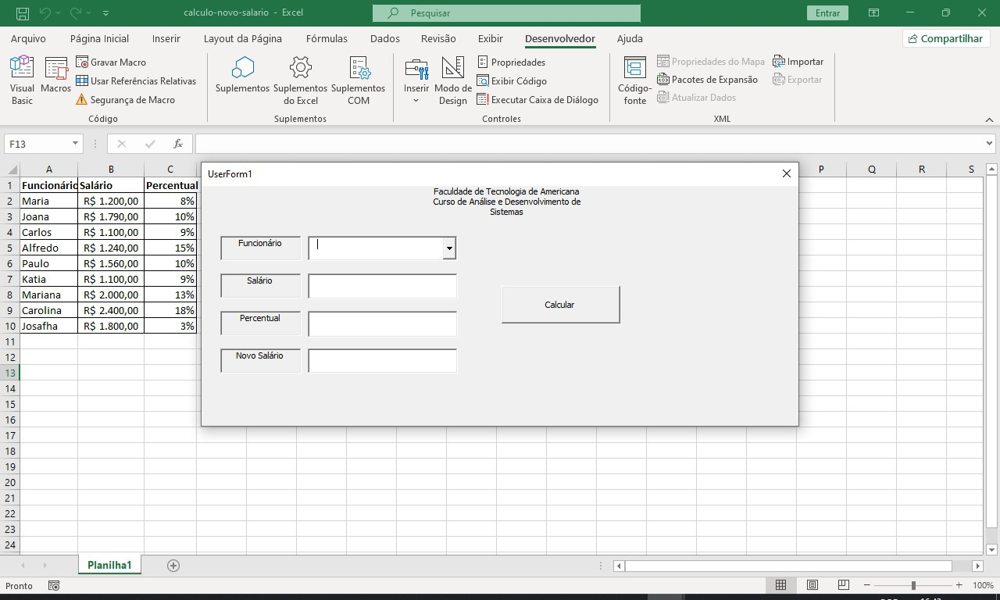

# 👨‍💻 Planilhas com Macros

Organizei alguns estudos realizados com `macros` no Excel, sendo especialmente conteúdos de aulas. Os conteúdos são:

> ⚠ Na maioria das planilhas não há muita validação já que o objetivo era apenas estudo.

## 📌 Conteúdo

| Arquivo               | Descrição                                                                 |
|------------------------|--------------------------------------------------------------------------|
| `calculo-novo-salario.xlsx`       | Cálcula o salário de funcionários de acordo com dados de uma tabela comum do excel. |
| `calculo-salarios.xlsx` | Realiza o cálculo de salário de acordo com o cargo do colaborador e suas horas trabalhadas. |
| `sistema-financiamento.xlsx` | Simula um sistema de financiamento de carros, de acordo com seu valor, taxa de juros, quantidade de parcelas e valor de entrada. |

---

## 🚀 Como acessar

- Baixa os arquivos
- Abra com algum programa de visualização de planilhas(Excel, Google Planilhas etc).

# ✅ Para habilitar o conteúdo macro:

- Passo 1: 

- Passo 2:

- Passo 3:

- Passo 4:

- Passo 5:

- Passo 6:

- Passo 7:

- Passo 8:

- Passo 9:

